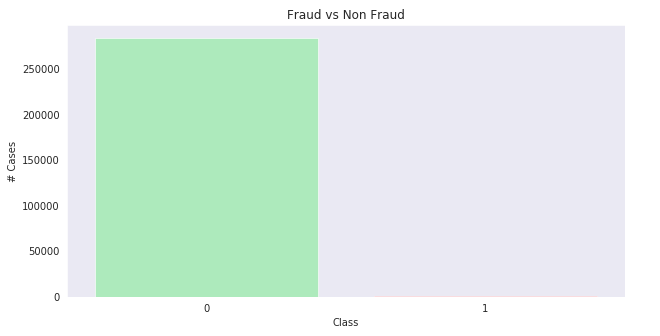
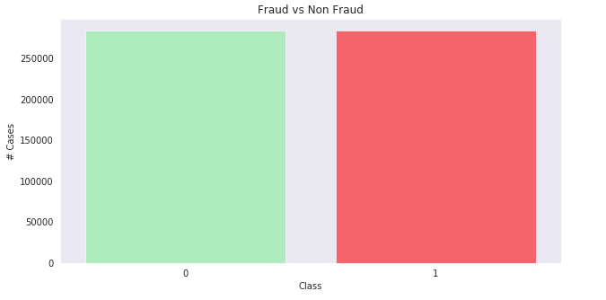
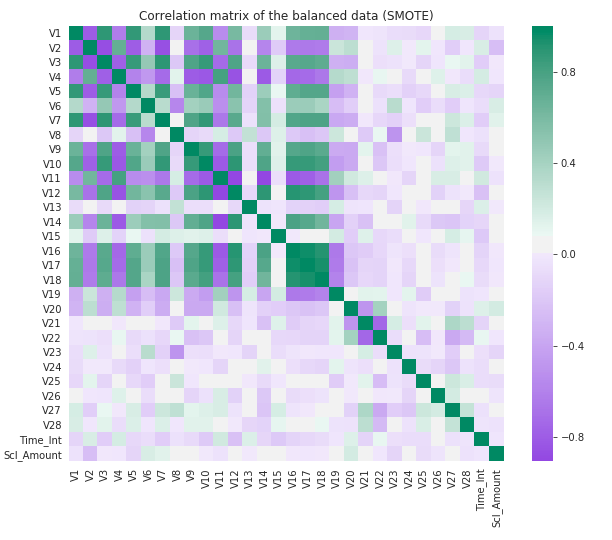
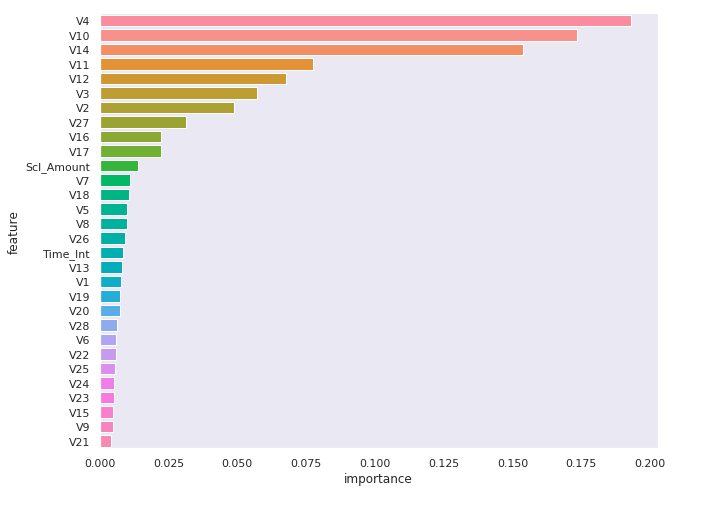
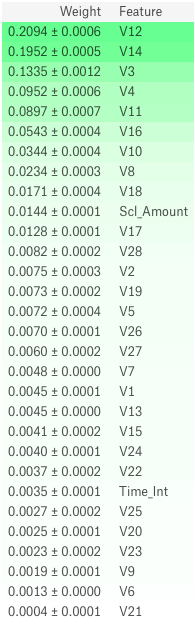
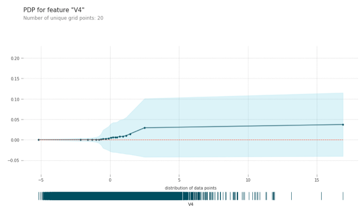
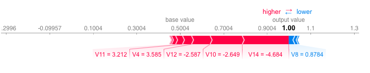
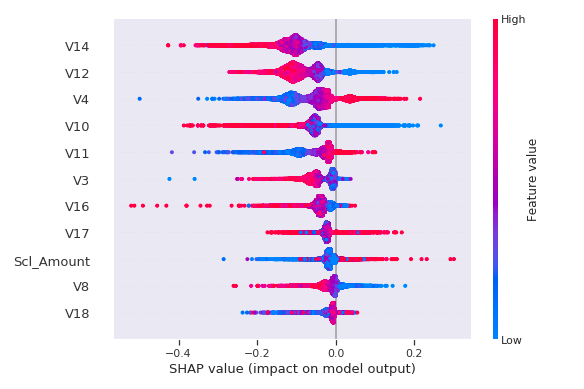
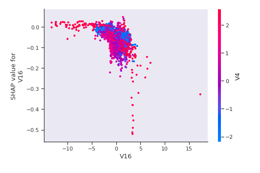

# Permutation-Importance-and-SHAP-on-Fraud-Classification

# Introduction
A take on highly imbalanced fraud classification using permutation importance to select top features and explaining the model using SHAP. Here's the kernel on [Kaggle](https://www.kaggle.com/vikramraju17/permutation-importance-and-model-explaining).

This is an interesting problem in flagging credit risk when all variables are dimensionally reduced (likely PCA as hinted in the problem). It becomes a pure data science exercise to see what can be done with the data and how to handle highly imbalanced classes.

We'll explore the below - 
* look at imbalanced classes
* test performance of the permutation importance in selecting important features
* and finally look at model explanation using shap and eli5

# SMOTE
When dealing with highly imbalanced classes it is important to balance the classes either by under sampling, over sampling, or over sampling using synthetic data generation. In this notebook we use SMOTE to balance classes and then look at the relationships within the features in the data.

Using SMOTE - 

# Permutation Importance
We'll use random forests to see what are the important features and compare against permutation importance. Unline random forests where we remove each column and estimate loss to weight importance, in permutation importance, we'll randomize the feature values in the respective column and estimate the loss in prediction to identify important features.

## Random forest feature importance

## Permutation importance

# SHAP

## Partial dependency plot
Let's see how changing the feature value of one feature affects the predictions. The y-axis shows the change in contribution to predictions over the spectrum of change in feature value.

## SHAP
SHAP allows us to look at a row of data and see which feature contributed to it's respective prediction and by what magnitude.

## SHAP spread on important features
We can also see the spectrum of how SHAP values of a feature changes, the magnitude of the spread, and it's dependency with other variables.

